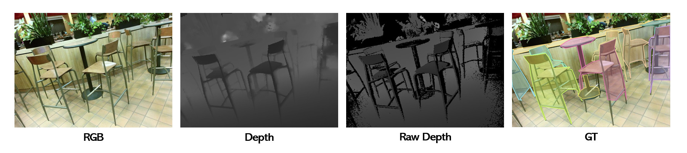

# SUN-RGBD-IS
A dataset converted from SUN-RGBD into COCO-style instance segmentation format

We have exclusively converted the data acquired from SUN-RGBD using Kinect v2



```
SUN-RGBD-IS
Train   : 5070 images
Val     : 4872 images
Classes : 18
Size    : 730 × 530
Sensor  : Kinect V1, Kinect V2, Intel Realsense, Asus Xtion
```

```
SUN-RGBD-IS-kv2
Train   : 2838 images
Val     : 946 images
Classes : 18
Size    : 730 × 530
Sensor  : Kinect V2
```
## Data preparation

```
SUNRGBD/
└── train/
    └── color/
└── val/
    └── color/
└── annotations/
    └── instances_train.json
    └── instances_val.json
└── train_depth/
└── train_depth_raw/
└── val_depth/
└── val_depth_raw/
```

## Data Format
```
annotation{
    "id": int,
    "image_id": int,
    "category_id": int,
    "segmentation": [polygon],
    "area": float,
    "bbox": [x,y,width,height],
    "iscrowd": 0 or 1,
}

categories[{
    "id": int,
    "name": str,
    "supercategory": str,
}]
```
